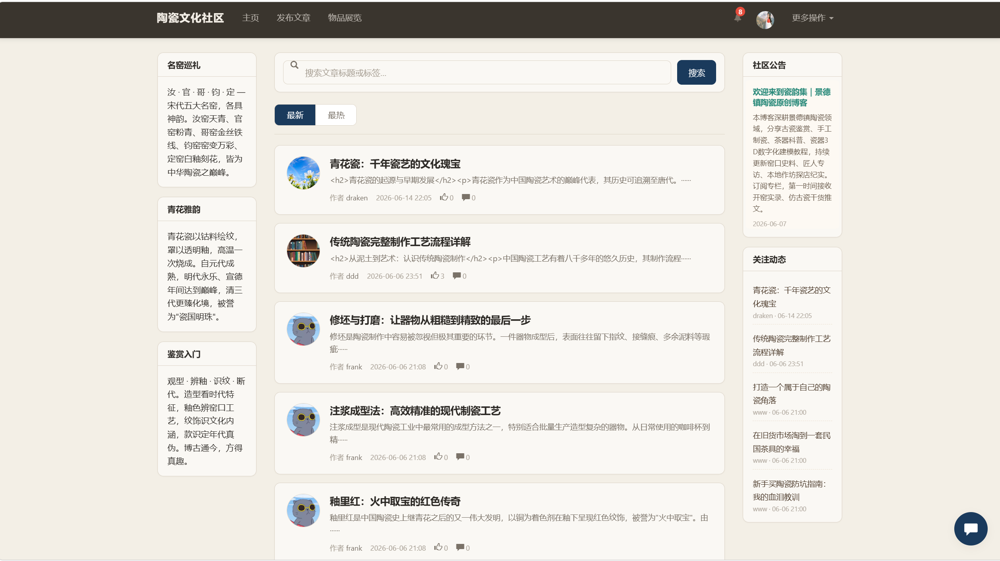
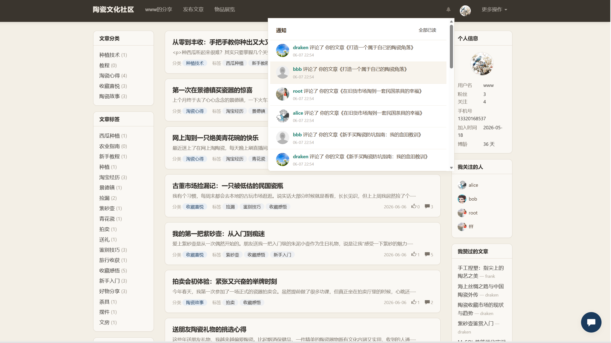
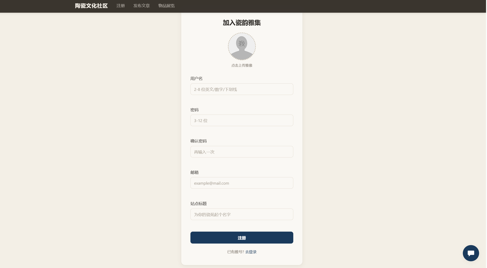
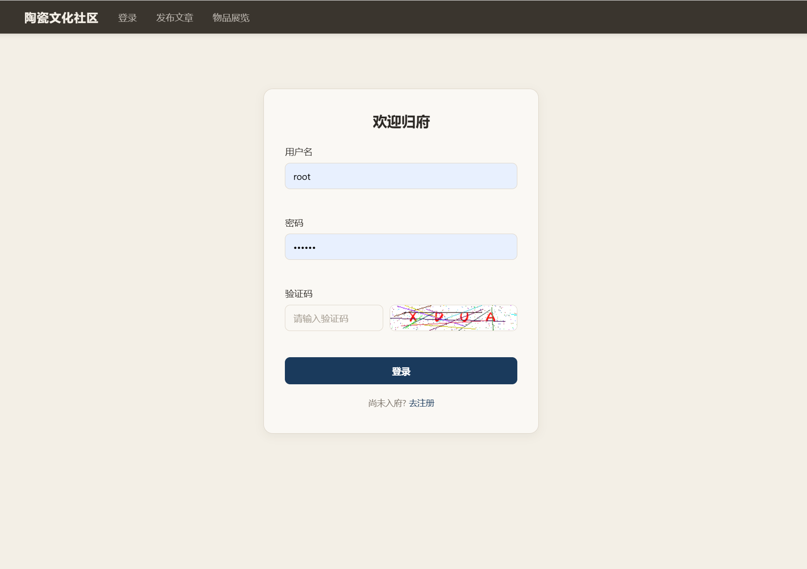
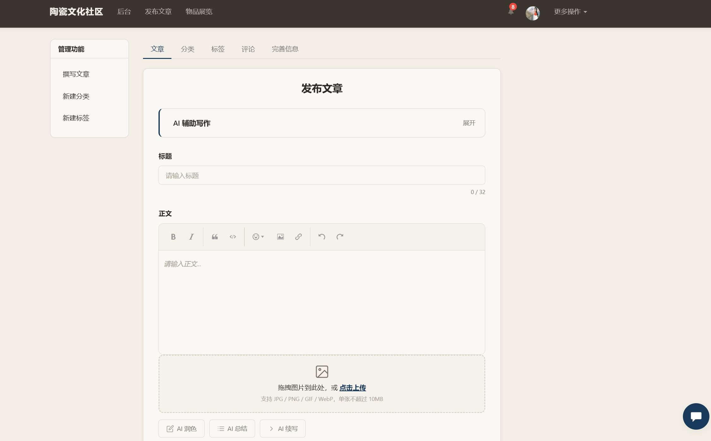
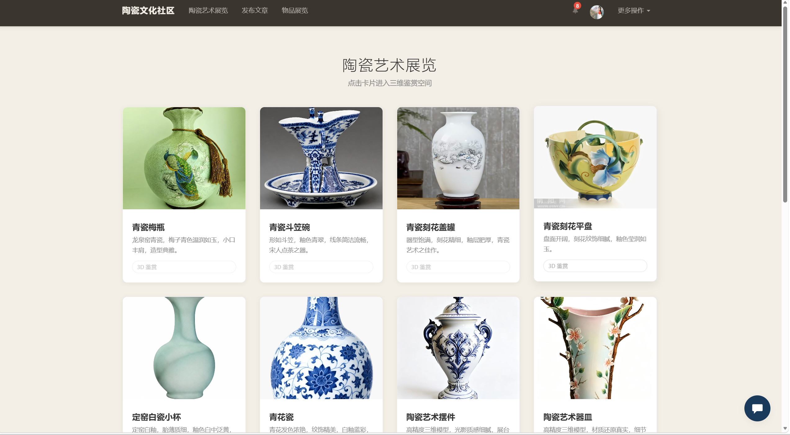
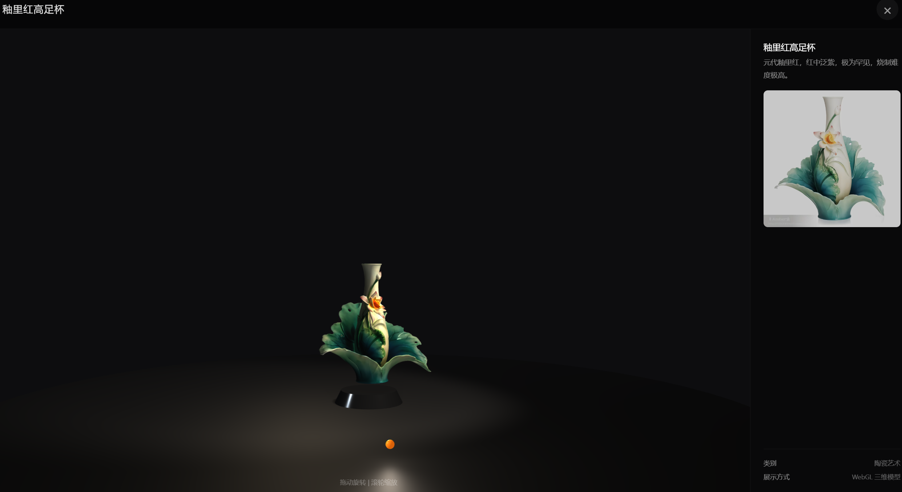
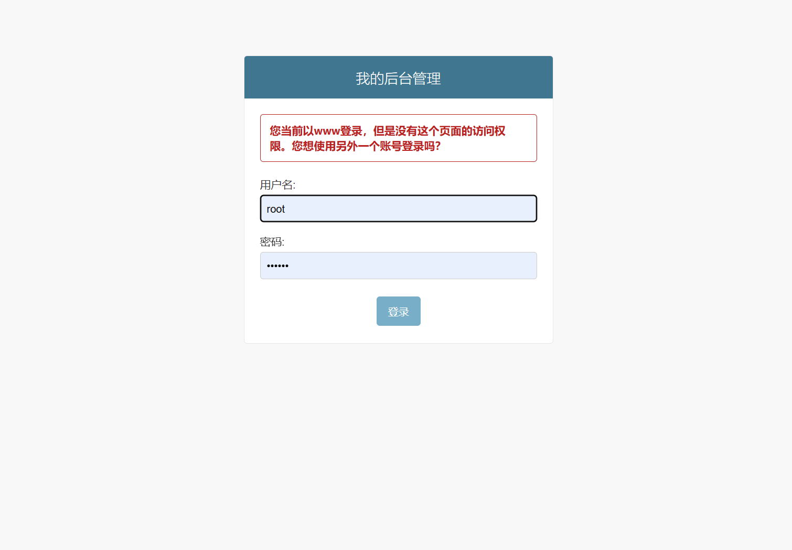
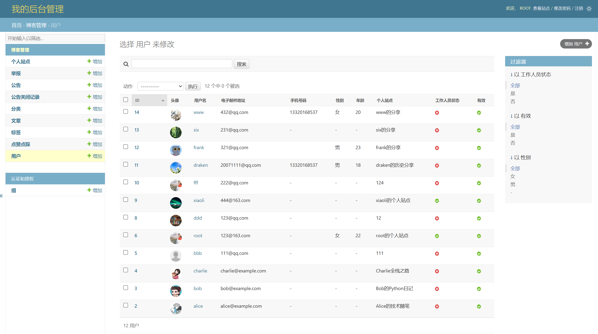

# 瓷韵社区（ceramic-blog）

融合 3D 展示技术的陶瓷文化社区平台设计与实现。

本项目是一个面向陶瓷爱好者的博客/社区系统，支持用户注册、发表文章、分类标签管理、评论互动、点赞点踩、关注/举报、通知公告等常规社区功能；同时集成了基于 Three.js 的 3D 展品展览、AI 写作辅助（生成、润色、续写、总结、自动分类/标签）以及 AI 问答助手，帮助用户更便捷地创作和浏览陶瓷相关内容。

---

## 功能特性

- **用户系统**：注册、登录、验证码、退出、修改密码/头像/个人信息
- **个人站点**：每位用户拥有独立站点，支持自定义站点名称、标题、主题 CSS
- **文章管理**：发布、编辑、删除文章，支持富文本编辑器与 base64 图片自动转存
- **分类与标签**：每站点独立管理分类和标签
- **互动功能**：点赞、点踩、评论（含二级回复）、评论点赞
- **社交功能**：关注/取关、@用户搜索、站内通知
- **内容治理**：文章举报与后台处理、文本相似度检测（防止重复发布）
- **公告系统**：顶部公告栏、用户关闭记录
- **3D 展览**：基于 Three.js 的陶瓷展品 3D 模型展示（伪 3D 帧序列 + GLTF 模型）
- **AI 助手**：
  - AI 问答助手
  - AI 生成文章
  - AI 润色改写
  - AI 续写
  - AI 总结
  - AI 自动分类/打标签

---

## 界面预览

### 首页与信息流

首页展示最新文章列表，左侧可按分类、标签筛选，右侧聚合社区公告、关注动态和个人信息卡片，支持站内通知实时提醒。



点击导航栏通知图标可查看评论、点赞、关注等消息提醒，方便用户及时参与互动。



### 用户注册

注册页支持上传头像、填写用户名/密码/邮箱，并可设置个人站点标题，注册后即可拥有独立的陶瓷博客站点。



### 用户登录

登录页支持用户名或邮箱登录，提供验证码验证、密码找回入口，并支持快速切换到注册页面。



### 文章发布与 AI 辅助

文章发布页集成 wangEditor 富文本编辑器，支持拖拽或点击上传图片；顶部可展开 AI 辅助写作面板，底部提供 AI 润色、总结、续写等一键操作，降低创作门槛。



### 3D 陶瓷展览

“陶瓷艺术展览”页面以卡片形式陈列各类陶瓷展品，点击即可进入详情页。



3D 展品详情页基于 Three.js 渲染模型，右侧同步展示器物名称、年代、工艺介绍，支持旋转、缩放等交互浏览。



### 后台管理

管理员通过独立后台登录页进入 Django 管理后台，可对用户、文章、分类、标签、评论等内容进行统一维护。





---

## 技术栈

- **后端**：Python 3.12 + Django 4.2.10
- **前端**：HTML + JavaScript + Bootstrap 3.4.1 + Three.js
- **数据库**：MySQL（默认）/ 开发测试可用 SQLite
- **富文本**：wangEditor
- **图片处理**：Pillow
- **HTML 净化**：bleach
- **AI 接口**：SiliconFlow / DeepSeek（HTTP 请求）
- **环境变量**：python-dotenv
- **缓存**：Redis + django-redis

---

## 环境要求

- Python 3.10+
- MySQL 5.7+（推荐 8.0，或使用 SQLite 快速测试）
- pip / virtualenv
- Redis 5.0+（用于页面缓存）
- 可选：Git LFS（如需上传 3D 模型等大文件到 GitHub）

---

## 安装与运行

### 1. 克隆仓库

```bash
git clone <你的仓库地址>
cd djangoProject14
```

### 2. 创建并激活虚拟环境

```bash
python -m venv venv

# Windows CMD
venv\Scripts\activate

# Windows PowerShell
venv\Scripts\Activate.ps1

# macOS / Linux
source venv/bin/activate
```

### 3. 安装依赖

```bash
pip install -r requirements.txt
```

> 注意：`mysqlclient` 在 Windows 上可能需要先安装 Visual C++ Build Tools 或 MySQL Connector/C。如果安装失败，可改用 `PyMySQL`，并在项目 `__init__.py` 中执行 `pymysql.install_as_MySQLdb()`。

### 4. 配置环境变量

```bash
cp .env.example .env
```

编辑 `.env` 文件，填入真实的 AI API Key；数据库相关配置说明如下：

```env
AI_API_KEY=your-siliconflow-api-key
AI_BASE_URL=https://api.siliconflow.cn/v1
AI_MODEL=deepseek-ai/DeepSeek-V3
AI_TIMEOUT=90

AI_API_KEY_BACKUP=your-deepseek-api-key
AI_BASE_URL_BACKUP=https://api.deepseek.com
AI_MODEL_BACKUP=deepseek-chat

# 开发测试可快速使用 SQLite，无需安装 MySQL
# DB_ENGINE=django.db.backends.sqlite3
```

> 提示：若不想安装 MySQL，将 `DB_ENGINE` 改为 `django.db.backends.sqlite3` 即可跳过“创建数据库”步骤。

### 5. 创建数据库

如果上一步将 `DB_ENGINE` 设置为 `django.db.backends.sqlite3`，可跳过本步骤，Django 会自动生成 `db.sqlite3` 文件。

若使用 MySQL，请登录并执行：

```sql
CREATE DATABASE myblog CHARACTER SET utf8mb4 COLLATE utf8mb4_unicode_ci;
```

如果数据库名称与 `.env` 中 `DB_NAME` 不一致，请同步修改 `DB_NAME`。

### 6. 执行迁移并创建超级用户

```bash
python manage.py migrate
python manage.py createsuperuser
```

### 7. 收集静态文件（可选，生产环境使用）

```bash
python manage.py collectstatic
```

### 8. 启动开发服务器

```bash
python manage.py runserver
```

访问 http://127.0.0.1:8000/index/ 即可。

后台管理地址：http://127.0.0.1:8000/admin/

---

## 项目结构

```
djangoProject14/
├── app01/                  # 主应用
│   ├── models.py           # 数据模型
│   ├── views/              # 视图模块
│   │   ├── account.py      # 用户注册/登录/退出/修改密码
│   │   ├── blog.py         # 首页/站点/文章详情/点赞
│   │   ├── interaction.py  # 评论/关注/通知/举报
│   │   ├── backend.py      # 后台文章/分类/标签管理
│   │   ├── ai.py           # AI 相关接口
│   │   └── announcement_api.py  # 公告 API
│   ├── utils/              # 工具模块
│   │   ├── ai_helper.py    # AI 调用封装
│   │   ├── code.py         # 验证码生成
│   │   ├── image_processor.py  # base64 图片转存
│   │   ├── text_similarity.py  # 文本相似度检测
│   │   └── dors.py         # 登录装饰器
│   ├── forms/              # Django 表单
│   ├── templatetags/       # 自定义模板标签
│   └── migrations/         # 数据库迁移文件
├── djangoProject14/        # 项目配置
│   ├── settings.py
│   ├── urls.py
│   └── wsgi.py
├── static/                 # 静态文件
│   ├── css/
│   ├── js/
│   ├── image/
│   ├── font/
│   ├── models/             # 3D 模型（大文件，默认忽略）
│   └── pseudo3d/           # 伪 3D 帧序列（大文件，默认忽略）
├── templates/              # HTML 模板
├── media/                  # 用户上传文件（默认忽略）
├── scripts/                # 3D 资源生成/处理脚本
├── requirements.txt        # Python 依赖
├── .env.example            # 环境变量示例
├── .gitignore              # Git 忽略规则
└── manage.py
```

---

## AI 功能配置说明

AI 功能默认调用 SiliconFlow 的 API，并支持 DeepSeek 官方作为备用通道。只需要在 `.env` 中配置对应的 `AI_API_KEY` 即可。

如需更换模型或接口，修改 `.env` 中的 `AI_MODEL` 和 `AI_BASE_URL`，或修改 `djangoProject14/settings.py` 中的默认值。

---

## Redis 缓存配置说明

项目已接入 Redis 作为 Django 缓存后端，用于加速首页、个人站点、文章详情、陶瓷展览等公共页面的访问速度。

当前默认配置（`djangoProject14/settings.py`）从 `.env` 读取 Redis 连接信息：

```python
REDIS_HOST = os.environ.get('REDIS_HOST', '127.0.0.1')
REDIS_PORT = os.environ.get('REDIS_PORT', '6379')
REDIS_PASSWORD = os.environ.get('REDIS_PASSWORD', '123456')
REDIS_DB = os.environ.get('REDIS_DB', '1')

CACHES = {
    "default": {
        "BACKEND": "django_redis.cache.RedisCache",
        "LOCATION": f"redis://:{REDIS_PASSWORD}@{REDIS_HOST}:{REDIS_PORT}/{REDIS_DB}",
        ...
    }
}
```

`.env.example` 中已包含 Redis 相关变量，复制为 `.env` 后按需修改即可。

### 启动 Redis

本地开发请确保 Redis 服务已启动：

```bash
# Windows（使用 MSYS2 / Git Bash）
redis-server

# 或使用 Windows 版 Redis 服务
```

### 缓存策略

- **未登录用户**：首页、展览页、个人站点、文章详情页会被缓存，重复访问直接从 Redis 读取。
- **已登录用户**：不走页面缓存，避免展示错误的个性化内容（如通知、关注动态）。
- **数据变更时自动清缓存**：发表/编辑/删除文章、新增/修改分类标签、评论、点赞、关注等操作会自动清除相关缓存。

### 生产环境建议

- 生产环境建议通过 `.env` 配置独立的 Redis 实例，并启用持久化或高可用方案。

---

## 3D 展览资源说明

项目中的 3D 展览功能依赖 `static/models/`（GLB 模型）和 `static/pseudo3d/`（预渲染帧序列），合计体积超过 2 GB，**不适合直接提交到普通 Git 仓库**。

可选方案：

1. **Git LFS**：安装 [Git Large File Storage](https://git-lfs.github.com/)，对大文件进行追踪后上传。
2. **云存储/CDN**：将模型和帧序列上传到对象存储或 CDN，通过配置远程地址加载。
3. **本地演示**：仅保留少量小模型用于演示，其余资源不上传。

---

## 安全与隐私提醒

在上传到 GitHub 之前，请务必检查以下内容：

1. **API Key**：当前 `.env` 文件中的 `AI_API_KEY` 和 `AI_API_KEY_BACKUP` 是真实密钥，`.gitignore` 已配置忽略 `.env`，但建议立即到对应平台（SiliconFlow / DeepSeek）**重置/轮换密钥**，以防历史提交或截图泄露。
2. **SECRET_KEY**：`SECRET_KEY` 默认从 `.env` 读取，请确保 `.env` 中设置为足够复杂的随机字符串，不要提交到仓库。
3. **数据库密码**：`settings.py` 中数据库密码通过 `.env` 读取，生产环境请使用强密码。
4. **Redis 密码**：`settings.py` 中 Redis 密码默认从 `.env` 读取，生产环境请使用强密码。
5. **DEBUG 模式**：`DEBUG = True` 仅适合开发，上线前必须改为 `False`。
6. **ALLOWED_HOSTS**：部署到生产环境时，必须填入真实域名。
7. **用户上传文件**：`media/` 目录已加入 `.gitignore`，请勿将用户头像、文章图片等提交到仓库。

---

## 许可证

MIT License

Copyright (c) 2026 200711999

---

## 贡献与反馈

欢迎提交 Issue 或 Pull Request。如有问题，也可通过 GitHub Discussions 交流。
